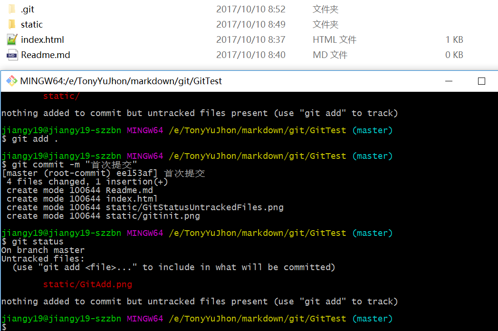

### Git的基本使用--将本地的文件Push到Github

##### Step 1 : 在本地创建一个文件夹,然后用GitBash打开文件夹所在的路径，执行git init命令
```bash
git init
```

执行完成之后，会出现一个.git的隐藏文件夹，此时这个文件夹就相当于变成了一个本地的git仓库。

##### Step 2 : 将需要提交的文件都粘贴到该文件夹下，使用git status查看文件的状态


##### Step 3 : 使用git add . 将本地文件**添加**到本地仓库
```bash
git add .
```


##### Step 4 : 执行git commit -m "Comment" 将本地文件**提交**到本地仓库
```bash
git commit -m "首次提交"
```


##### Step 5 : 将文件推送到远程Github仓库，首先必须得建立一个仓库哈，然后将本地仓库和远程仓库进行关联
```bash
git remote add origin https://github.com/YuJhon/GitUsage.git
```


##### Step 6 : 使用git push -u origin master把本地仓库的项目推送到远程仓库
```bash
git push -u origin master
```


##### 查看结果


##### 注意：
　　由于新建的远程仓库是空的，所以要加上-u这个参数，等远程仓库里面有了内容之后，下次再从本地库上传内容的时候只需下面这样就可以了
```bash
git pull origin master
git push origin master
```
